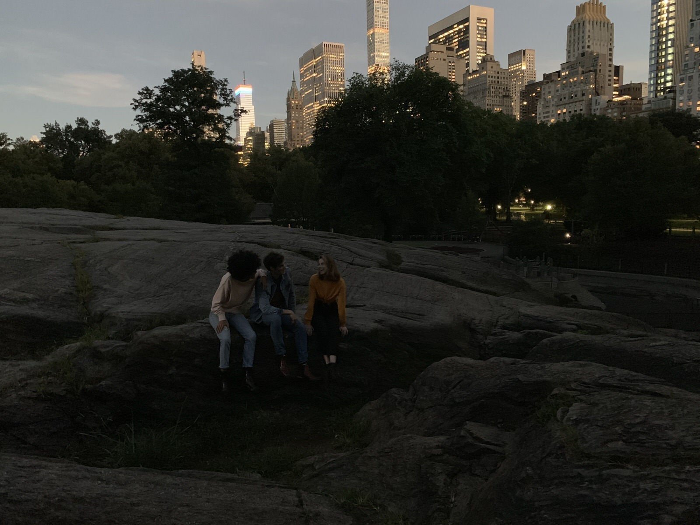
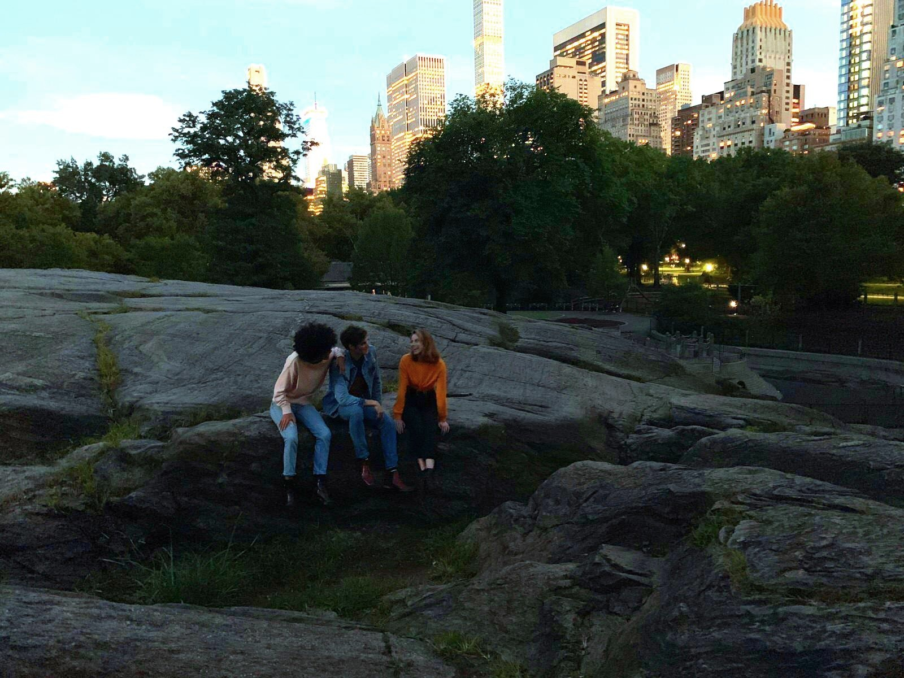
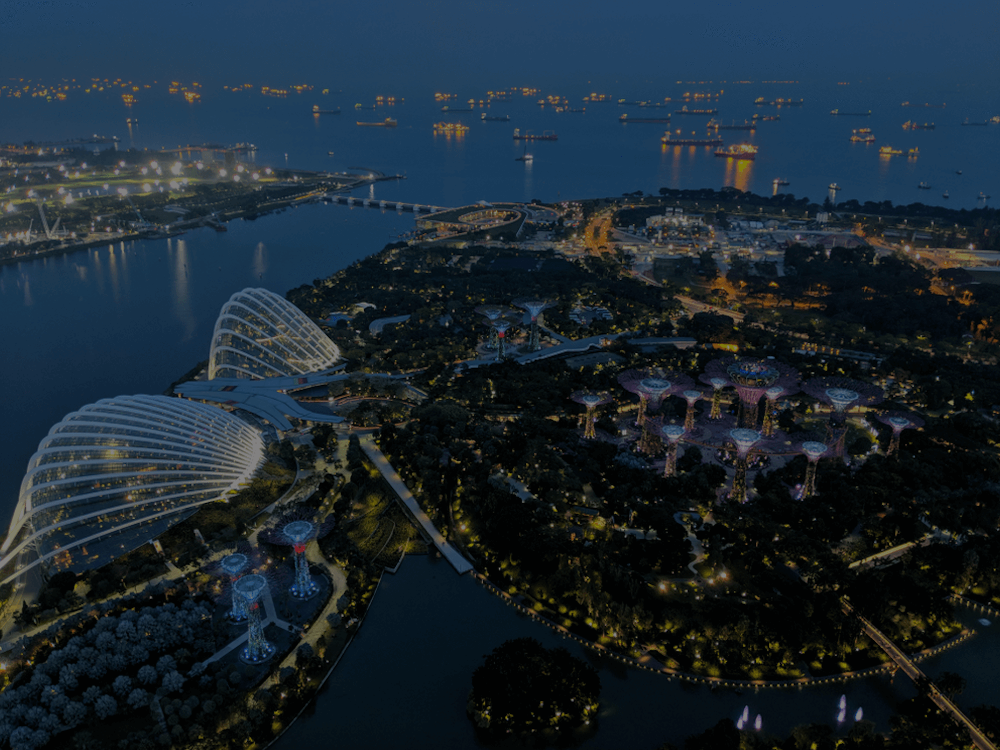
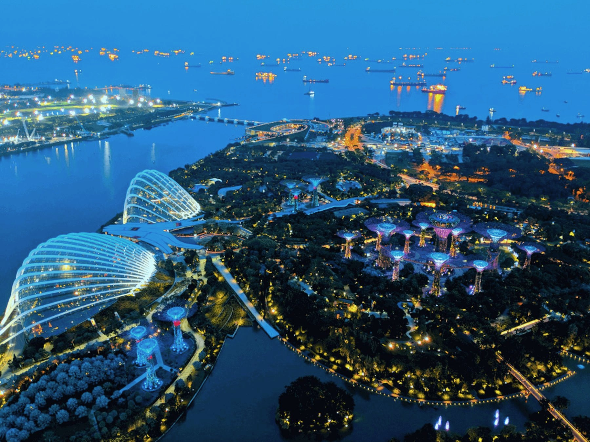
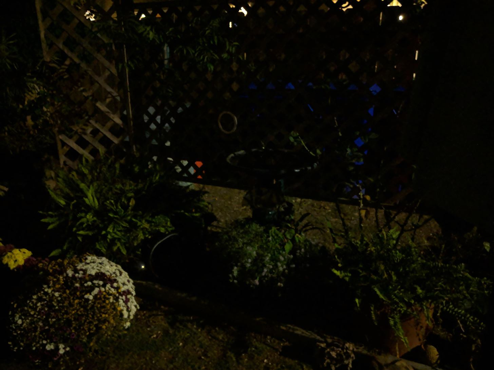
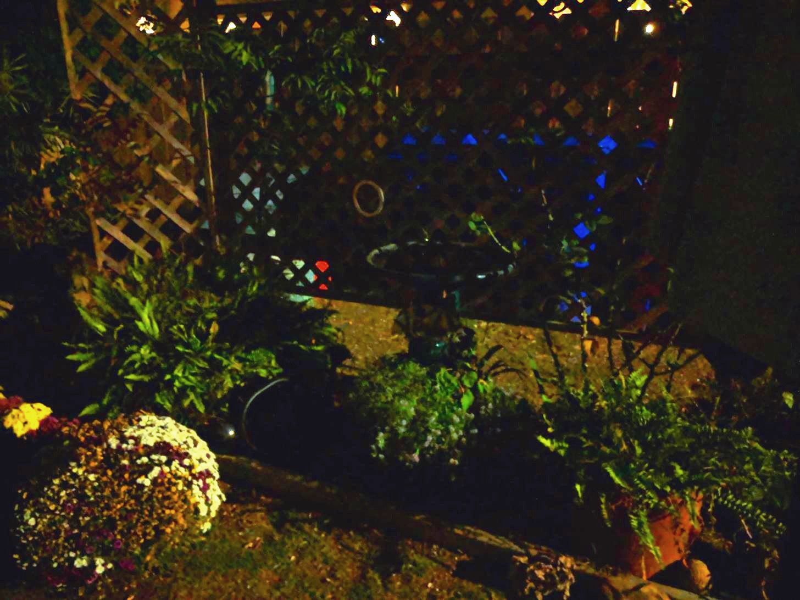
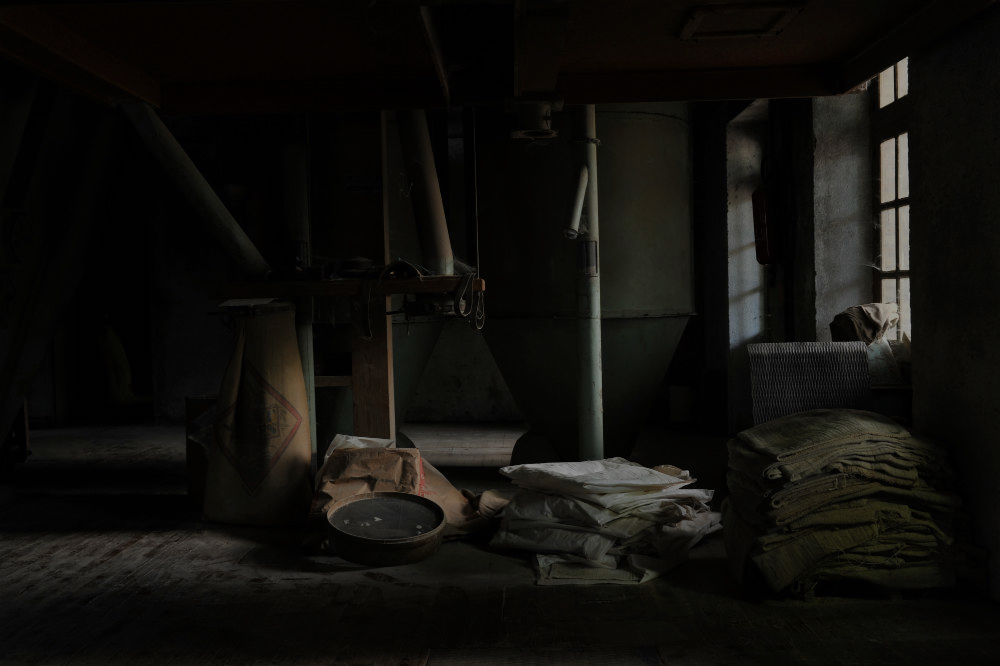
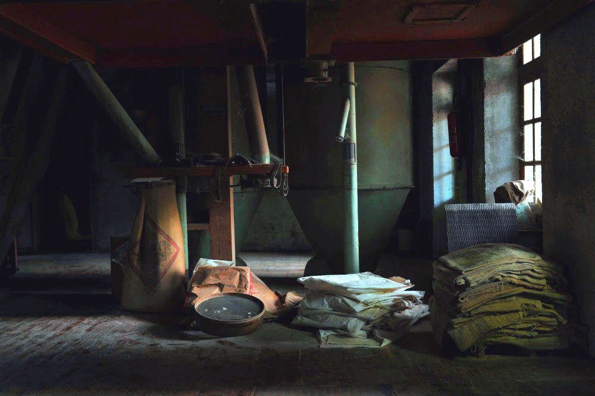

# night-sight

https://nightsight-vinaynaidu.herokuapp.com/

This is one of the computational photography approaches for improved night mode. Google launched nightsight with the pixel 3 series and I've tried to implement something close to it using Machine Learning. It's one of the early versions and I'm still trying to improve it. 
For some images it may improve the overall quality (Input1 & 2), making them look a lot better, and for some images it may uncover new details (Input3 & 4). Try it with the sample images.

Input 1

Output 1

Input 2

Output 2

Input 3

Output 3

Input 4

Output 4

